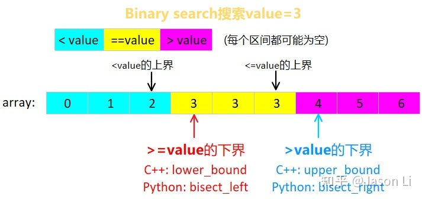

# 目录

## 基础

### 二分的本质是什么

- 其实算法的本质就是一个庞大的状态机，二分就是**根据给定的条件**，将数据**分割**为不同的两个部分，然后对其中的一个部分再进行一次条件的判断（这里要保证分割后的数据也能进行同样的查找，其实就是递归），直到符合**出口的判断条件**后退出
- 所以二分就有很多的变种，针对给定的条件，或是数据分割的条件，或是二分退出的条件做出一些魔改
- 

- 发现很多语言的标准库提供的都是左闭右开的二分查找，并且都只提供了寻找下界的接口
- PS：下面所讨论的是基于>=value下界的情况，而上界可以通过下界-1得到，>value又可以通过调整mid的位置得到<=value的上界以后+1得到
- 所以，我们下面专注于>=value的情况讨论
- 左闭右开的好处
  - 区间两端值的差，如[0, 4)中的4 - 0 = 4，正好是区间或数组的长度
  - 刚好相邻的区间，如[0, 2)和[2, 4)， 中间值（即2）相同，一眼就可以看出来


### 关于区间的选取

- 很多标准库提供对外的接口都是左闭右开的，所以最好就是左闭右开
- 但是，我个人写二分喜欢左闭右闭，这种写法见仁见智吧，所以我下面的讨论都是默认左闭右闭的


### 为什么不是三分查找

- https://www.zhihu.com/question/336354646
- 借助数学公式，可以发现如果k太大会使得时间复杂度退回到O(n)，而二分为其最优解


### 浮点数的二分查找


### 是left<right还是left<=right

其实两者在不同的情景下都是可以的
- 对于left<right，后续left和right的调整是可以变为mid的
- 而left<=right，后续的调整是不可以变为mid的（因为会造成死循环）


### 关于mid的写法

- 直接写`int mid = (left + right) / 2;`，在cpp和java中容易越界溢出

- ```cpp
  int mid = right + (left - right) / 2;	//	方法一
  int mid = left + (right - left) / 2;	//	方法二
  
  //	对于数量为奇数的数组，两者mid的位置都是一样的
  //	对于数量为偶数的数组，方法一会取值偏向右边的那个数
  	//	而方法二会取值偏向左边的那个数
  	//	举例：如果最后的left和right分别是0和1的话，此时right被调整为1的，那么方法一就会进入死循环
  
  //	所以，具体如何调整，要看题目的需求
  	//	比如说在排序数组中找一个数字的左右边界
  	//	如果要先找左边界，那么当nums[mid]==target的时候，就要调整right，而为了防止死循环就要用方法二；
  	//	如果要先找右边界，那么当nums[mid]==target的时候，就要调整left，而为了防止死循环就要用方法一
  //	由此得到的二级结论就是如果选用方法一，就不能把right调整为mid
  //		如果选用方法二，就不能把left调整为mid
  
  //	总结：一般情况下最好选择方法二
  //	至于后续要怎么调整，完全要看题目的要求来写，不能盲目迷信
  ```


### 关于left和right的调整

- 其实left和right的调整是非常灵性的，要根据题目的要求，mid的写法和left和rihgt的判断条件来共同调整
- 但是要注意的就是关于mid的写法里面的，注意mid调整的位置


### 二分模板

- ```cpp
  //要求，找当前target在nums中的位置，如果在，就返回下标；否则，返回它应该插入的位置
  int left = 0, right = nums.size() - 1;
  
  //	二分模板1.0
  //	如果target大于当前所有的数字的话，那么返回的则是当前最后一个元素的下标，而不是该元素应该插入的位置
  //	如果要找的target不存在（但是值又不大于全体数字），就会返回该元素应该插入的位置
  while (left < right) {
      int mid = left + (right - left) / 2;
      if (nums[mid] < target) {
          left = mid + 1;
      } else {
          right = mid;
      }
  }
  return left;
  
  //二分模板2.0（克服了1.0的缺点）（不过这种方法有点绕，需要理解一哈）
  while (left <= right) {
      int mid = left + (right - left) / 2;
      if (nums[mid] >= target) {
          right = mid - 1;
      } else {
          left = mid + 1;
      }
  }
  return left;
  
  //二分模板3.0，最简单易懂的模板，是在2.0的基础上改造的，更加容易理解
  while (left <= right) {
      int mid = left + (right - left) / 2;
      if (nums[mid] == target) {
          return mid;
      } else if (nums[mid] > target) {
          right = mid - 1;
      } else {
          left = mid + 1;
      }
  }
  return left;
  ```


## 旋转数组

#### 找最小元素（存在重复元素）

- 例题：154、寻找旋转排序数组中的最小值 II（剑指 Offer 11. 旋转数组的最小数字）

- 如果mid和right相等的话应该怎么办（right--）
  
- 防止长度溢出（使用left + (right - left) / 2）

- 为什么不能用left进行比较

- ```cpp
      /*
      对于旋转后的数组有两种情况::
      	一种是前面的较大的那一部分数组长度大于数组长度的一半
      	另一种情况是前面的较大的那一部分数组长度小于数组长度的一半
      如果中间的那个数大于左边（或者中间的那个数大于右边），那最小的数就在右边，对应第一种情况
      中间的数小于左边（或者中间的那个数小于右边），那最小的数就在左边，对应第二种情况
    
      用中间元素比较左边或者右边的方法都可以判断属于哪一种情况，是吗？
      	其实不是的，比较左边数的方法是不可行的
      	因为如果到某一个时候，分隔到的小数组是没有被旋转的
      	那中间的数大于左边的数，然后就直接往右边寻找了，很显然是错误的
      所以只能是对右边的数进行比较
    
      如果遇到当前的mid值和边界值相等，怎么办？
      	就把边界值向中间靠拢一个单位
      原因：既然当前的mid对应的值和边界值相等，那我就把边界靠拢向中间，然后再来一次二分
      相等就继续二分，直到不相等，这样就在缩小范围的同时，也能有效避免因为相同元素导致递归结果错误
      因为如果二者相等的话，其实我们是不知道到底因该想做还是向右的（即第一种情况或者第二种情况都会发生）
      */
  class Solution {
  public:
      int minArray(vector<int>& numbers) {
          int n = numbers.size();
          int left = 0, right = n - 1;
  
          while (left < right) {
              int mid = (right - left) / 2 + left;
              if (numbers[mid] > numbers[right]) {
                  left = mid + 1;
              } else if (numbers[mid] < numbers[right]){
                  right = mid;
              } else {
                  -- right;
              }
          }
  
          return numbers[left];
      }
  };
  ```


#### 找最小元素（不存在重复元素）

- 例题：153、寻找旋转排序数组中的最小值

- 思路上和前面一模一样

- ```cpp
  class Solution {
  public:
      int findMin(vector<int>& nums) {
          int left = 0, right = nums.size() - 1;
  
          while (left < right) {
              int mid = left + (right - left) / 2;
              if (nums[mid] > nums[right]) {
                  left = mid + 1;
              } else {
                  right = mid;
              }
          }
  
          return nums[left];
      }
  };
  ```


#### 查找元素（不存在重复元素）返回下标

- 例题：33、搜索旋转排序数组

- 和前面几乎一样
  
- 需要注意的：left <= right时=的用处（因为这里如果找不到的话需要返回的是-1，为了方便就用了=，同时在循环里面进行判断）

- 所以，这里是改不了用left<right的写法的吗（存疑）

- 以及这里为什么nums[mid] >= nums[left]（因为如果是[3,1]要找1的情况，如果没有=，那么就会跳到下面一种情况，就会出错）（update：这里如果nums[mid]和nums[left]相等的话，就让left++，这种方法都可以适用的）

- ```cpp
  class Solution {
  public:
      int search(vector<int>& nums, int target) {
          int n = nums.size(), left = 0, right = n - 1;
  
          while (left <= right) {
              int mid = left + (right - left) / 2;
              if (nums[mid] == target) {
                  return mid;
              }
              if (nums[mid] > nums[left]) {
                  if (target < nums[mid] && target >= nums[left]) {
                      right = mid - 1;
                  } else {
                      left = mid + 1;
                  }
              } else if (nums[mid] < nums[left]) {
                  if (target > nums[mid] && target <= nums[right]) {
                      left = mid + 1;
                  } else {
                      right = mid - 1;
                  }
              } else {
                  ++ left;
              }
          }
  
          return -1;
      }
  };
  ```


#### 查找元素（存在重复元素）返回是否存在

- 例题：81、搜索旋转排序数组 II

- 和上一道题可以用一模一样的方法
  
- ```cpp
  class Solution {
  public:
      bool search(vector<int>& nums, int target) {
          int left = 0, right = nums.size() - 1;
  
          while (left <= right) {
              int mid = left + (right - left) / 2;
              if (target == nums[mid]) {
                  return true;
              }
              if (nums[mid] > nums[left]) {
                  if (target >= nums[left] && target < nums[mid]) {
                      right = mid - 1;
                  } else {
                      left = mid + 1;
                  }
              } else if (nums[mid] < nums[left]) {
                  if (target > nums[mid] && target <= nums[right]) {
                      left = mid + 1;
                  } else {
                      right = mid - 1;
                  }
              } else {
                  left ++ ;
              }
          }
  
          return false;
      }
  };
  ```


#### 查找元素（存在重复元素）返回目标元素第一次出现的位置的下标

- 例题：面试题 10.03. 搜索旋转数组

- 基本上就是上面一道题了，不同的是要返回第一次元素出现的位置的下标（即如果当前的nums[mid]等于target，就要调整right的位置；如果当前的nums[left]等于target，就直接返回）

- ```cpp
  class Solution {
  public:
      int search(vector<int>& arr, int target) {
          int left = 0, right = arr.size() - 1;
  
          while (left <= right) {
              if (arr[left] == target) {
                  return left;
              }
              int mid = left + (right - left) /2;
              if (target == arr[mid]) {
                  right = mid;
              } else if (arr[mid] > arr[left]) {
                  if (target < arr[mid] && target >= arr[left]) {
                      right = mid - 1;
                  } else {
                      left = mid + 1;
                  }
              } else if (arr[mid] < arr[left]) {
                  if (target <= arr[right] && target > arr[mid]) {
                      left = mid + 1;
                  } else {
                      right = mid - 1;
                  }
              } else {
                  left ++ ;
              }
          }
  
          return -1;
      }
  };
  ```


## 一维二分

#### 35、搜索插入位置

- 需要注意的就是如果当前没有要查找的数应怎么办

- ```cpp
  class Solution {
  public:
      int searchInsert(vector<int>& nums, int target) {
          int left = 0, right = nums.size() - 1;
  
          while (left < right) {
              int mid = left + (right - left) / 2;
              if (nums[mid] < target) {
                  left = mid + 1;
              } else {
                  right = mid;
              }
          }
  
          if (nums[left] < target) {
              return 1 + left;
          }
          return left;
      }
  };
  ```


#### 剑指 Offer 53 - I. 在排序数组中查找数字 I

- 调整target==nums[mid]的位置以及mid的写法，从而得到数据的左边界和有边界

- 通过这种方法，也可以实现lower_bound（找到当前数组中刚好不小于target的数字的第一个位置，即找第一个能够实现>=target位置的数字）

- ```cpp
  class Solution {
  public:
      int search(vector<int>& nums, int target) {
          if (nums.size() == 0) {
              return 0;
          }
          int left = 0, right = nums.size() - 1;
          while (left < right) {
              int mid = left + (right - left) / 2;
              if (nums[mid] >= target) {
                  right = mid;
              } else {
                  left = mid + 1;
              }
          }
  
          if (nums[left] != target) {
              return 0;
          }
          int res = left;
          left = 0;
          right = nums.size() - 1;
          while (left < right) {
              int mid = right + (left - right) / 2;
              if (nums[mid] > target) {
                  right = mid - 1;
              } else {
                  left = mid;
              }
          }
  
          return left - res + 1;
      }
  };
  ```


#### 34.在排序数组中查找元素的第一个和最后一个位置

- 同上

- ```cpp
  class Solution {
  public:
      vector<int> searchRange(vector<int>& nums, int target) {
          vector<int> res{-1, -1};
          int left = 0, right = nums.size() - 1;
          if (right < 0) {
              return res;
          }
  
          while (left < right) {
              int mid = left + (right - left) / 2;
              if (nums[mid] >= target) {
                  right = mid;
              } else {
                  left = mid + 1;
              }
          }
  
          if (nums[left] != target) {
              return res;
          }
          res[0] = left;
          left = 0;
          right = nums.size() - 1;
  
          while (left < right) {
              int mid = right + (left - right) / 2;
              if (nums[mid] <= target) {
                  left = mid;
              } else {
                  right = mid - 1;
              }
          }
  
          return {res[0], left};
      }
  };
  ```


#### 633、平方数之和

- ```cpp
  class Solution {
  public:
      bool judgeSquareSum(int c) {
          int left = 0, right = (int)sqrt(c);//int强制转型
          
          while (left <= right){
              long res =  c - right * right;//防止溢出
              if (res == left * left){
                  return true;
              }else if (res < left * left){
                  right -- ;
              }else{
                  left ++ ;
              }
          }
  
          return false;
      }
  };
  ```


#### 69、x的平方根

- ```cpp
  class Solution {
  public:
      int mySqrt(int x) {
          int left = 0, right = x, res = 0;
  
          while (left <= right) {
              int mid = left + (right - left) / 2;
              if ((long long)mid * mid <= x) {
                  res = mid;
                  left = mid + 1;
              } else {
                  right = mid - 1;
              }
          }
  
          return res;
      }
  };
  ```


#### 162、寻找峰值

- 例题：剑指 Offer II 069. 山峰数组的顶部

- 如果后面的比我大，那就证明后面必定有山峰，否则就山峰就在前面

- 其实这里的调整一定要注重mid和left以及right后续的调整，不要陷入死循环里面

- ```cpp
  class Solution {
  public:
      int findPeakElement(vector<int>& nums) {
          int left = 0, right = nums.size() - 1;
  
          while (left < right){
              int mid = left + (right - left) / 2;
              if (nums[mid] <= nums[mid + 1]){
                  left = mid + 1;
              }else{
                  right = mid;
              }
          }
  
          return left;
      }
  };
  
  class Solution {
  public:
      int findPeakElement(vector<int>& nums) {
          int left = 0, right = nums.size() - 1;
  
          while (left < right) {
              int mid = right + (left - right) / 2;
              if (nums[mid] > nums[mid - 1]) {
                  left = mid;
              } else {
                  right = mid - 1;
              }
          }
  
          return left;
      }
  };
  ```


#### 540、有序数组中的单一元素

- 例题剑指offer II 070.排序数组中只出现一次的数字（只有一个数字出现了一次，其他数字都出现了两次）

- 如果当前的mid为偶数的话，就证明左半边数字的数量是偶数（数组是从0开始的），那此时mid就要和mid+1进行比较（这里就要好好思考一下为什么一定是和mid+1比较），如果和mid+1相同，那left就要往右边移动；否则就要往左边移动

- 而如果当前的mid为奇数的话，左半边数字的数量就是奇数，那此时mid就要和mid-1进行比较，如果和mid-1相同，left就要往右边移动

- 综合一下，发现用异或运算^可以完美的根据奇偶解决要比较的数字

- ```cpp
  class Solution {
  public:
      int singleNonDuplicate(vector<int>& nums) {
          int left = 0, right = nums.size() - 1;
  
          while (left < right) {
              int mid = left + (right - left) / 2;
              if (nums[mid] == nums[mid ^ 1]) {
                  left = mid + 1;
              } else {
                  right = mid;
              }
          }
  
          return nums[left];
      }
  };
  ```


#### 4、寻找两个正序数组的中位数

- ```cpp
  /**
  解题思路：二分法
  
  此题求两个有序数组的中位数，并且限制时间复杂度为O(log (m+n))，所以自然想到要用二分法求解。
  
  中位数：如果某个有序数组长度是奇数，那么其中位数就是最中间那个，如果是偶数，那么就是最中间两个数字的平均值。这里对于两个有序数组也是一样的，假设两个有序数组的长度分别为m和n，由于两个数组长度之和m+n的奇偶不确定，因此需要分情况来讨论，对于奇数的情况，直接找到最中间的数即可，偶数的话需要求最中间两个数的平均值。
  
  使用一个小trick，可以避免讨论奇偶：
  我们分别找第 (m+n+1)/2个数，和(m+n+2)/2个数，然后求其平均值即可，这对奇偶数均适用。假如 m+n 为奇数的话，那么其实 (m+n+1) / 2 和 (m+n+2) / 2 的值相等，相当于两个相同的数字相加再除以2，还是其本身。
  
  那么接下来重点就变成如何在两个有序数组中找到第K个（第k小的）元素。
  首先，为了避免产生新的数组从而增加时间复杂度，我们使用两个变量 i 和 j 分别来标记数组nums1和nums2的起始位置。
  
  递归出口：
  当K=1时候，相当于求最小值，我们只要比较nums1和nums2的起始位置i和j上的数字就可以了。
  
  一般情况：
  取两个数组中的第k/2个元素（midVal1和midVal2）进行比较，如果midVal1 < midVal2，则说明数组1中的前k/2个元素不可能成为第k个元素的候选，所以将数组1中的前k/2个元素去掉，作为新数组和数组2求第k-k/2小的元素，因为我们把前k/2个元素去掉了，所以相应的k值也应该减少k/2。midVal1 > midVal2的情况亦然。
  
  边界问题：
  
  当某一个数组的起始位置大于等于其数组长度时，说明其所有数字均已经被淘汰了，相当于一个空数组了，那么实际上就变成了在另一个数组中找数字，直接就可以找出来了。
  
  由于两个数组的长度不定，所以有可能某个数组元素数不足k/2，所以我们需要先检查一下，数组中到底存不存在第K/2个数字，如果存在就取出来，否则就赋值上一个整型最大值，这样肯定会大于另一个数组的第k/2个元素，从而把另一个数组的前k/2个元素淘汰。
  
  ps：赋予整型最大值的意思只是说如果第一个数组的K/2不存在，则说明这个数组的长度小于K/2，那么另外一个数组的前K/2个我们是肯定不要的。例如，加入第一个数组长度是2，第二个数组长度是12，则K为7，K/2为3，因为第一个数组长度小于3，则无法判断中位数是否在其中，而第二个数组的前3个肯定不是中位数！
  
  每一轮次的快排都需要选择一个枢轴 pivot，上面的解法里默认以 low 下标指向的数组元素作为枢轴，也就是每次排序都以最左边的第一个元素作为枢轴，这时候比较的顺序就必须先从右往左比较再从左往右比较，如此才能保证每一轮次的快排都能让比枢轴小的元素被换到了枢轴左边，比枢轴大的元素被换到了枢轴右边。
  
  反之，如果先从左往右比较再从右往左比较(就是你说的两行互换后的写法)，在两次 while 结束后 i 和 j 碰面的位置对应的数组元素必定大于枢轴，之后 swap 的时候就会把大元素与枢轴进行 swap，这样就无法保证枢轴两侧左小右大的结果了
  **/
  
  class Solution {
  public:
      double findMedianSortedArrays(vector<int> &nums1, vector<int> &nums2) {
          int m = nums1.size();
          int n = nums2.size();
          return (findKth(nums1, 0, nums2, 0, (m + n + 1) / 2) + findKth(nums1, 0, nums2, 0, (m + n + 2) / 2)) / 2.0;
      }
      //在两个有序数组中找到第k个元素（例如找第一个元素，k=1，即nums[0]）
      // i: nums1的起始位置 j: nums2的起始位置（i，j都是从0开始）
      int findKth(vector<int> &nums1, int i, vector<int> &nums2, int j, int k) {
          //若nums1为空（或是说其中数字全被淘汰了），在nums2中找第k个元素，此时nums2起始位置是j，所以是j+k-1
          if (i == nums1.size()) {
              return nums2[j + k - 1];
          }
          // nums2同理
          if (j == nums2.size()) {
              return nums1[i + k - 1];
          }
  
          //递归出口（当k等于1的时候，就直接返回两边的最小值）
          if (k == 1) {
              return min(nums1[i], nums2[j]);
          }
  
          //这两个数组的第K/2小的数字，若不足k/2个数字则赋值整型最大值，以便淘汰另一数组的前k/2个数字（因为如果有一边不足k/2的话，那么另一边一定会淘汰掉k/2的）
          int midVal1 = (i + k / 2 - 1 < nums1.size()) ? nums1[i + k / 2 - 1] : INT_MAX;
          int midVal2 = (j + k / 2 - 1 < nums2.size()) ? nums2[j + k / 2 - 1] : INT_MAX;
  
          //二分法核心部分
          //注意这里都是k-k/2，因为15/2=7，但是我们前面加上k/2的时候，筛掉的是7，后面应该再找第8个，而不是第7个
          if (midVal1 < midVal2) {
              return findKth(nums1, i + k / 2, nums2, j, k - k / 2);
          }
          return findKth(nums1, i, nums2, j + k / 2, k - k / 2);
      }
  };
  
  ```


## 二维二分

- 二维数组寻找峰值（和一维的类似：先找一列上的峰值，然后看是否为左右峰值，不是的话再继续调整）


#### 378、有序矩阵中第k小的元素

- 这道题太难了，背答案吧

- ```cpp
  class Solution {
  private:
      int n{};
  public:
      bool check(vector<vector<int>>& matrix, int mid, int k) {
          int i = n - 1, j = 0;
          int num = 0;
          while (i >= 0 && j < n) {
              if (matrix[i][j] <= mid) {
                  num += i + 1;
                  j ++ ;
              } else {
                  i -- ;
              }
          }
          return num >= k;
      }
  
      int kthSmallest(vector<vector<int>>& matrix, int k) {
          n = matrix.size();
          int left = matrix[0][0];
          int right = matrix[n - 1][n - 1];
  
          while (left < right) {
              int mid = left + (right - left) / 2;
              if (check(matrix, mid, k)) {
                  right = mid;
              } else {
                  left = mid + 1;
              }
          }
  
          return left;
      }
  };
  ```


#### 74、搜索二维矩阵

- 从右上角或者左下角开始走即可（即一定要有一行或有一列为max才行）

- ```cpp
  class Solution {
  public:
      bool searchMatrix(vector<vector<int>>& matrix, int target) {
          int n = matrix.size(), m = matrix[0].size();
          int i = 0, j = m - 1;
  
          while (i < n && j >= 0) {
              if (matrix[i][j] == target) {
                  return true;
              } else if (matrix[i][j] > target) {
                  -- j;
              } else {
                  ++ i;
              }
          }
  
          return false;
      }
  };
  ```


#### 240、搜索二维矩阵 II

- 和上一题一样的思路

- ```cpp
  class Solution {
  public:
      bool searchMatrix(vector<vector<int>>& matrix, int target) {
          int n = matrix.size(), m = matrix[0].size();
          int i = 0, j = m - 1;
  
          while (i < n && j >= 0) {
              if (matrix[i][j] == target) {
                  return true;
              } else if (matrix[i][j] > target) {
                  -- j;
              } else {
                  ++ i;
              }
          }
  
          return false;
      }
  };
  ```


## 双调数组

- 双调数组04（对一个先递增后递减的数组去重，要求时间复杂度O(n)）
  - 从左右两个指针开始向中间走，谁小就谁放进去，放完后再去重


## 其他

### 二分法找绝对值最小的数

- 有一个已经排好序的整数序列（升序，无重复项），序列中可能有正整数、负整数或者0，请用你认为最优的方法求序列中绝对值最小的数

- ```cpp
  int find(vector<int>& arrs) {
      if (arrs[0] >= 0) return arrs[0];
      else if (arrs.back() <= 0) return arrs.back();
      
      int left = 0, right = arrs.size() - 1;
      while (left < right) {
          int mid = left + (right - left) / 2;
          if (arrs[mid] <= 0 && arrs[mid + 1] > 0) {
              if (abs(arrs[mid]) < abs(arrs[mid + 1])) {
                  return arrs[mid];
              } else {
                  return a
              }
          } else if (arrs[mid] > 0) {
              right = mid - 1;
          } else if (arrs[mid] < 0) {
              left = mid + 1;
          }
      }
  }
  ```

- 


### 思路

- 这里给我们的一个启发就是，要假设最后只有两个数字，那此时会不会死循环


# 参考

- https://www.zhihu.com/question/36132386/answer/530313852
