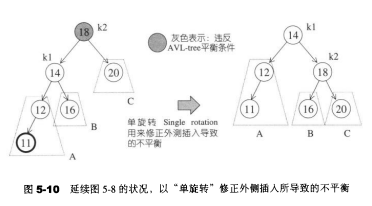
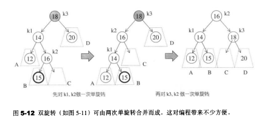

# 前置知识

## 树

### 定义

- 是由n(n>=1)个有限结点组成一个具有层次关系的集合，是n个结点的有限集

- 若n=0，则称为空树
- 若n>0，则它满足如下两个条件
  - 有且仅有一个特定的称为根的结点
  - 其余结点可分为m个互不相交的有限集T1,T2,T3,...,Tm，其中每一个集合本身又是一棵树，并称为根的子树
- 树的定义是一个递归的定义

- 有关树的基本概念：
  - 结点：数据元素以及指向子树的结点
    - 根结点：非空树中无前驱结点的结点
  - 结点的度：结点拥有的子树数
  - 树的度：树内各结点的度的**最大值**
    - 叶子：度数为0，终端结点
    - 非终端结点：度数不为0
  - 内部节点：根节点以外的分支结点
  - 结点的子树的根称为该结点的**孩子**，该节点称为该孩子的**双亲**
  - 同一个双亲是**兄弟**，而双亲在同一层结点的为**堂兄弟**
  - 结点的**祖先**：从根到该结点所经分支上的所有结点
  - 结点的**子孙**：以某节点为根的子树中的任一结点
  - 树的**深度**：树中结点的最大层次
  - 有序树：树中结点的各子树从左到右有次序（最左边的为第一个孩子），即子树的位置是不可以变换的
  - 无序树：树中结点的各子树无次序
- 树的结构
  - 根节点，只有一个，无双亲
  - 叶子节点（可以有多个），无孩子
  - 其他结点-中间结点，一个双亲，多个孩子

### 树的遍历

- 先序遍历
  - 若树不为空，则先访问根节点，然后依次先跟遍历各棵子树
- 后序遍历
  - 若树不为空，则先依次后跟遍历各棵子树，然后先访问根节点
- 层次遍历
  - 若树不为空，则自上而下自左至右访问树中每个结点

### 树的存储结构

- 双亲表示法
  - 实现：定义结构数组，存放树的结点，每个结点存放两个域
    - 数据域：存放结点信息
    - 双亲域：指示本结点的双亲结点在数组中的位置
  - 特点：找双亲容易，找孩子难
- 孩子链表表示法
  - 实现：把每个结点的孩子结点排列起来，看成是一个线性表，用单链表存储。则n个结点有n个孩子链表（叶子的孩子链表为空表），而n个头指针又组成一个线性表，用顺序表存储
  - 特点：找孩子容易，找双亲难
- 孩子兄弟表示法（二叉树表示法，二叉链表表示法）
  - 实现：用二叉链表作树的存储结构，链表中每个结点的两个指针域分别指向第一个孩子和下一个兄弟结点

## 二叉树的转换

### 二叉树与树的转换

- 原理：给定一棵树，可以找到唯一的一颗二叉树与之对应
- 树变二叉树：**兄弟相连留长子**
  - 加线：在兄弟之间加一条线
  - 抹线：对每个结点，除了其左孩子之外，去除其与其余孩子之间的关系
  - 旋转：以树的根结点为轴心，将整颗树顺时针旋转45o
- 二叉树变树：**左孩右右连双亲，去掉原来右孩线**
  - 加线：若p结点是双亲结点的左孩子，则将p的右孩子，右孩子的右孩子（以此类推），沿分支找到的所有右孩子，由于p的双亲相连（如果有一个结点，是它双亲的左孩子，那么就把这个结点的右孩子以及右孩子的右孩子都和它的双亲连接）
  - 抹线：抹掉原二叉树中双亲与右孩子之间的连线（去掉双亲和右孩子之间的线）
  - 调整：将结点按层次排列，形成树结构

### 二叉树与森林的转换

- 森林变二叉树：**树变二叉根相连**
  - 将每棵树分别转换成二叉树
  - 将每棵树的根结点用线相连
  - 以第一棵树根节点为二叉树的根，再以根节点为轴心，顺时针旋转，构成二叉树型结构
- 二叉树变森林：**去掉全部右孩线，孤立二叉再还原**
  - 抹线：将二叉树中根节点与其右孩子连线，以及沿右分支搜索到的所有右孩子间连线全部抹掉，使之变成孤立的二叉树
  - 还原：将孤立的二叉树还原为树

## 森林

### 定义

- 是m(m>=0)棵互不相交的树的集合

- 与树的关系：
  - 树一定是森林，森林不一定是树（m=0）
  - 一棵树也可以看成是特殊的森林
  - 对于一棵树，把根节点删除，就变成了森林

### 森林的遍历

- 森林的三部分
  - 森林中第一棵树的根结点
  - 森林中第一棵树的子树森林
  - 森林中其他树构成的**森林**
- 先序遍历
  - 访问森林中第一颗树的根结点
  - 先序遍历森林中第一棵树的子树森林
  - 先序遍历森林中（除第一棵树之外）其余树构成的森林
  - 即依次从左至右对森林中的每一棵树进行先根遍历
- 中序遍历
  - 中序遍历森林中第一棵树的子树森林
  - 访问森林中第一棵树的根结点
  - 中序遍历森林中（除第一棵树之外）其余树构成的森林
  - 即依次从左至右对森林中的每一棵树进行后根遍历

## B+树

### B+树

- 有k个子树的中间节点包含有k个元素（B树中是k-1个元素），每个元素不保存数据，只用来索引，所有数据都保存在叶子节点

- 所有的叶子结点中包含了全部元素的信息，及指向含这些元素记录的指针，且叶子结点本身依关键字的大小自小而大顺序链接

- 所有的中间节点元素都同时存在于子节点，在子节点元素中是最大（或最小）元素
- https://zhuanlan.zhihu.com/p/54102723（参考）

### 背景

- avl树：自平衡二叉查找树
- 红黑树
- B+树/B树
  - 它们特点是一样的，是多路查找树，一般用于数据库系统中，为什么，因为它们分支多层数少呗，都知道磁盘IO是非常耗时的，而像大量数据存储在磁盘中所以我们要有效的减少磁盘IO次数避免磁盘频繁的查找
  - B+树主要应用于文件系统中，最大的原因是它高度平衡，branch factor较大，这样可以减少磁盘IO

- 针对大量数据，如果在内存中作业就优先考虑红黑树（map，set，RB-tree实现），如果在硬盘中作业就优先考虑B系列（B+树，B-树）

### 红黑树和AVL树

- 红黑树类似AVL树，但提供更快的实时性，插入和删除有界最坏情况性能（最多两个分别旋转和三次旋转以平衡树），但查询时间稍慢（logn）
- 如果插入一个node引起了树的不平衡，AVL和RB-Tree都是最多只需要2次旋转操作，即两者都是O(1)；但是在删除node引起树的不平衡时，最坏情况下，AVL需要维护从被删node到root这条路径上所有node的平衡性，因此需要旋转的量级O(logN)，而RB-Tree最多只需3次旋转，只需要O(1)的复杂度
- 其次，AVL的结构相较RB-Tree来说更为平衡，在插入和删除node更容易引起Tree的unbalance，因此在大量数据需要插入或者删除时，AVL需要rebalance的频率会更高。因此，RB-Tree在需要大量插入和删除node的场景下，效率更高。自然，由于AVL高度平衡，因此AVL的search效率更高
- map的实现只是折衷了两者在search、insert以及delete下的效率。总体来说，RB-tree的统计性能是高于AVL的
- 总的来说，是功能性能空间开销的折中结果
  - AVL更平衡，结构上更加直观，时间效能针对读取而言更高；维护稍慢，空间开销较大
  - 红黑树，读取略逊于AVL，维护强于AVL，空间开销与AVL类似，内容极多时略优于AVL，维护优于AVL
- 红黑树虽然定义复杂，但是它的限制条件是相对AVL宽松的。所以在进行插入删除操作的时候出现违反限制条件的状况较少，因而重平衡操作出现的机会比AVL少。基于上述原因，许多需要进行频繁删插操作的场景都使用来红黑树
- avl树平衡度高，调整频率高，适合查询多，增删少的场景
- 红黑树平衡度低，调整频率低，适合增删多的场景

### 红黑树和B树

- 红黑树多用在内部排序，即全放在内存中的，微软STL的map和set的内部实现就是红黑树
- B树多用在内存里放不下，大部分数据存储在外存上时。因为B树层数少，因此可以确保每次操作，读取磁盘的次数尽可能的少
- 在数据较小，可以完全放到内存中时，红黑树的时间复杂度比B树低。反之，数据量较大，外存中占主要部分时，B树因其读磁盘次数少，而具有更快的速度

### 红黑树的应用场景

- 为什么要用RB-tree
  - 二叉查找树在大多数情况下查找和插入在效率上是没有问题的，但是在最坏的情况下效率比较低，但是平衡二叉树能够保证在最坏的情况下也能达到lgN，要实现这一目标，我们就要保证在插入完成后始终保持平衡状态。在一棵具有N个节点的树中，我们希望该树的高度能够维持在lgN左右，这样我们就能保证只需要lgN次比较操作就可以查找到想要的值。不幸的是，每次插入元素之后维持树的平衡状态太昂贵。所以就出现一些新的数据结构来保证在最坏的情况下插入和查找效率都能保证在对数的时间复杂度内完成。而我们所讲的红黑树就属于此新的数据结构之一，除此之外还有B树等数据结构
- Linux的的进程调度，用红黑树管理进程控制块，进程的虚拟内存空间都存储在一颗红黑树上，每个虚拟内存空间都对应红黑树的一个节点，左指针指向相邻的虚拟内存空间，右指针指向相邻的高地址虚拟内存空间
- epoll
- stl中的map，set
- java中的treemap
- nginx中用红黑树管理定时器，因为红黑树是有序的，所以可以很快的得到距离当前最小的定时器

### AVL树的应用场景

- 最早的平衡二叉树之一。应用相对其他数据结构比较少。windows对进程地址空间的管理用到了AVL树
- 适合插入删除次数比较少，但查找多的情况

### B/B+树的引用场景

- 用在磁盘文件组织，数据索引和数据库索引

### 红黑树的性质

- 一种自平衡的二叉查找平衡树
- 节点要么是红色，要么是黑色
- 根节点是黑色
- 所有叶子节点都是黑色
- 每个红色节点的两个子节点都是黑色（每个叶子到根的所有路径上不能有两个连续的红色节点）
- 从任一节点到每个叶子节点的所有路径都包含相同树木的黑色节点
- 红黑树的具体操作实现（http://www.akathink.com/2016/08/08/%E5%BD%BB%E5%BA%95%E6%90%9E%E6%87%82%E7%BA%A2%E9%BB%91%E6%A0%91/）
- [红黑树](https://www.nowcoder.com/jump/super-jump/word?word=红黑树)的红节点表示的是节点与其子节点有一个左倾红链接
  [红黑树](https://www.nowcoder.com/jump/super-jump/word?word=红黑树)的是2-3-4树的一种实现。2-3-4树是阶数为4的B树
  2-3-4树种的2节点对应[红黑树](https://www.nowcoder.com/jump/super-jump/word?word=红黑树)中的黑色节点，非2节点以红节点加黑节点的方式存在，红节点的意义是与黑色父节点结合，表达着2-3-4树中的3，4节点
  2-3树到[红黑树](https://www.nowcoder.com/jump/super-jump/word?word=红黑树)的转化
  2节点转换为黑节点、3节点转换为左倾[红黑树](https://www.nowcoder.com/jump/super-jump/word?word=红黑树)，且红节点为子结点
  定义：
  1、节点颜色有红色和黑***r /> 2、根节点一定是黑***r /> 3、叶子节点一定是黑***r /> 4、不会有连续的红色节点
  5、是一棵二叉查找树
  [红黑树](https://www.nowcoder.com/jump/super-jump/word?word=红黑树)的左旋可以将右倾转换为左倾
  [红黑树](https://www.nowcoder.com/jump/super-jump/word?word=红黑树)的颜色反转，将4节点降为三个2节点

### 为什么有了avl树，还有红黑树

- AVL树实现比较复杂，而且删除和插入性能差，AVL树每次插入和删除都需要计算每个节点左右子树的高度差，调整时需要进行很多的左旋或者右旋操作，而红黑树只需要通过判断颜色匹配规则然后进行简单的调整即可达到整棵树的平衡

## 红黑树

### 定义

- 是一种特化的AVL树，**不要求绝对平衡**，从而减少二叉树的旋转次数

  - 红黑树： 不是要求绝对平衡，付出的代价是要着色，查询次数可能会多一层，好处是减少旋转次数
- AVL：要求绝对平衡，付出的代价是要计数，旋转次数可能会多，好处是所有查询都是最短路径

和AVL树的对比（更加细化的比较）

- 和红黑树相比，AVL树是严格的平衡二叉树，平衡条件必须满足所有节点的左右子树高度差不超过1
  - 而红黑树是一种弱平衡二叉树，**所以在相同的节点情况下，AVL树的高度低于红黑树**

- 通过对任何一条从根到叶子的路径上各个节点着色的方式的限制，**红黑树确保没有一条路径会比其它路径长出两倍**（从而在整体上保持了平衡）
- 在插入上，avl树和红黑树都能保证常数级别的旋转实现（**avl树插入新节点所需要的最大旋转次数是常数**）
  - 查找上，二者性能上几乎是一模一样的（可能红黑树会略逊与avl树）
  - 但在删除上，avl的极端情况可能需要logn的时间复杂度实现，而红黑树至多需要三次旋转，rb-tree在删除上的性能优于avl
  - 
  - 总结：**rb-tree的旋转次数是小于avl的**
  - https://www.zhihu.com/question/30527705/answer/259948086

### 特点

- 每个节点是红色或者黑色
- 根节点是黑色
- 每个红色结点的两个子结点都是黑色
- 对任意一个结点来说，从它到空结点的所有路径必须包含相同数目的黑色结点
- 所有叶子节点都是黑色的

### 应用

- C++广泛用在C++的STL中。如map和set都是用红黑树实现的
- JavaJava的集合框架(HashMap、TreeMap、TreeSet)；HashMap的底层实现，在JDK1.8中为了解决过度哈希冲突带来的长链表，当链表长度大于某个阈值会将链表转为红黑树
- Linux操作系统CFS进程调度算法中，vruntime利用红黑树来进行存储，选择最小vruntime节点调度
- 数据包CD / DVD驱动程序执行相同的操作
- 高分辨率计时器代码使用rbtree来组织未完成的计时器请求
- ext3文件系统跟踪红黑树中的目录条目
- 虚拟内存结构管理（VMA）
- 多路复用技术的Epoll的核心结构也是红黑树+双向链表
- 加密密钥和网络数据包均由红黑树跟踪
- Linux应用程序nginx用红黑树管理timer等。 

## 最优二叉树（哈夫曼树）

- 基本概念：
  - 判断树：用于描述分类过程的二叉树
  - 路径：从树中一个结点到另一个结点之间的分支构成这两个结点间的路径
  - 结点路径长度：两结点路径上的分支数（即边的数量）
  - 树的路径长度（记作TL）：从树根到每一个结点的路径长度之和
    - 结点数目相同的二叉树中，完全二叉树是路径长度最短的二叉树（但是路径长度最短不一定是完全二叉树）
  - 权：将树中结点赋给一个有着某种含义的数值，则这个数值称为该结点的权
  - 结点的带权路径长度：从根结点到该结点之间的路径长度与该结点的权的乘积
  - 树的带权路径长度：树中所有叶子结点的带权路径长度之和
- 定义：
  - 给定N个权值作为N个叶子结点，构造一棵二叉树，若该树的带权路径长度达到最小，称这样的二叉树为最优二叉树，即哈夫曼树
  - 带权路径长度最短是在度相同的树中比较而得的结果，即带权路径长度（WPL）最短的树

- 特点及性质：
  - 满二叉树不一定是哈夫曼树
  - 哈夫曼树中权值越大的叶子离根越近
    - 贪心算法：构造哈夫曼树时首先选择权值小的叶子结点
  - 哈夫曼树的结点的度数为0或2，没有度数为1的结点
  - 包含n个叶子结点的哈夫曼树中共有2n-1个结点
  - 包含n棵树的森林要经过n-1次合并才能形成哈夫曼树，共产生n-1个新结点
  - 经过n-1次合并产生n-1个新结点，且这n-1个新结点都是具有两个孩子的分支结点
- 构造哈夫曼树（哈夫曼算法）：
  - **构造森林全是根**
    - 根据n个给定权值{w1,w2,w3...,wn}，构成n棵二叉树的森林F={T1,T2,T3,...,Tn}，其中Ti只有一个带权为wi的根结点
  - **选用两小造新树**
    - 在F中选取两棵根结点的权值最小的树作为左右子树，构造一颗新的二叉树，且设置新的二叉树的根结点的权值**为其左右子树上根节点的权值之和**
  - **删除两小添新人**
    - 在F中删除这两棵树，同时将这新得到的二叉树加入到森林中
  - **重复二三剩新根**
    - 重复第二和第三这两个步骤，直至森林中只有一棵树为止，最后得到的树便是哈夫曼树
- 哈夫曼树的应用：
  - 挖坑

## B-树

- 多路平衡查找树
- 每一个节点最多包含k个孩子，k被称为B树的阶，k的大小取决于磁盘页的大小
- 根结点至少有两个子女
- 每个中间节点都包含k-1个元素和k个孩子，其中 m/2 <= k <= m
- 每一个叶子节点都包含k-1个元素，其中 m/2 <= k <= m
- 所有的叶子结点都位于同一层
- 每个节点中的元素从小到大排列，节点当中k-1个元素正好是k个孩子包含的元素的值域分划。

https://zhuanlan.zhihu.com/p/54084335

## 二叉树

### 定义

- 出现的背景：
  - 结构最简单，规律性强
  - 可以证明，所有树都能转为唯一对应的二叉树，不失一般性
- 定义：是n(n>=0)个结点的有限集，它或者是空集（n=0），或者由一个根节点及两颗互不相交的分别称作这个根的左子树和右子树的二叉树组成
- 特点：
  - 每个结点最多有两个孩子
  - 子树是有左右之分的，次序不能颠倒（即为有序树）
    - 所以即使只有一颗子树，都要区分是左子树还是右子树
    - 对比树，树只有一个孩子的时候无需分辨是左还是右
    - 所以二叉树和树是两种不同的概念，但是树的基本术语对二叉树都是适用的
  - 二叉树是空集合，根可以有空的左子树或空的右子树
  - 二叉树的编号方式：从上到下，从左到右

### 性质

- 在二叉树的第i层上至多有2i-1个结点（i>=1）
  - 在第i层至少有1个结点
- 深度为k的二叉树至多有2k-1个结点（k>=1）
  - 深度为k至少有k个结点
- 对任何一颗二叉树T，**如果其叶子数为n0，度为2的结点数为n2，则n0=n2+1**
  - 面试笔试考得太多了

### 特殊的二叉树

#### 满二叉树

- 定义：一颗深度为k且有2k-1个结点的二叉树
- 特点：
  - 每一层的结点数都是最大结点数（即每一层都满了）
  - 在顺序存储下能够复原
  - 叶子节点全部在最底层
  - 在同样深度的二叉树中**结点个数最多**，**叶子结点个数最多**

#### 完全二叉树

- 定义：深度为k的具有n个结点的二叉树，当且仅当其每一个结点都与深度为k的满二叉树中的编号为1-n的结点一一对应

特点

- 在满二叉树中，从最后一个结点开始，**连续**去掉**任意**个结点，即是一颗完全二叉树
- 叶子只可能分布在层次最大的两层上
- 对任一结点，如果其右子树的最大层次为i，则其左子树的最大层次必为i或i+1
- 满二叉树一定是完全二叉树，但是完全二叉树不一定是满二叉树

性质

- 具有n个结点的完全二叉树的深度为**$\lfloor$log2n$\rfloor$+1**
- 对于一颗完全二叉树来说，从上到下，从左到右编号，则对于任一一个结点i，有：
  - 若i=1，则为二叉树的根
  - 若i>1，则其双亲的结点为$\lfloor$$i/2\rfloor$
  - 若2i>n，则结点i为叶子结点，无左孩子；否则，其左孩子是结点2i
  - 若2i+1>n，则结点i无右孩子；否则，其右孩子是结点2i+1

- 特殊的完全二叉树
  - 败者树
  - 胜者树

### 二叉树的遍历

- 定义：顺着某一条搜索路径巡访二叉树中的结点，使得每个结点均被访问一次，而仅被访问一次
- 目的：得到树中所有结点的一个线性排列
- 用途：是树结构的插入、删除、修改、查找和排序运算的前提，是二叉树一切运算的基础和核心
- 二叉树与遍历的关系：
  - 若二叉树中各结点的值均不相同，则二叉树结点的先序遍历、中序遍历和后序遍历都是唯一的
  - 由二叉树的先序遍历和后序遍历，或后序遍历和中序遍历可以确定唯一一颗二叉树
- 先序遍历+中序遍历，中序遍历+后序遍历都可以恢复原本的树
- 拓展：对于一个算术表达式
  - 先序遍历：表达式的前缀表示（波兰式）
  - 后序遍历：表达式的后缀表示（逆波兰式）

#### 先序遍历

- **根左右**

- 先访问根节点，再先序遍历左子树，最后先序遍历右子树

#### 中序遍历

- **左根右**
- 先中序遍历左子树，再访问根节点，最后中序遍历右子树

#### 后序遍历

- **左右根**
- 先后序遍历左子树，再后序遍历右子树，最后访问根节点

#### 层序遍历

- 一层又一层的遍历数据

### 二叉树的存储结构

#### 顺序存储结构

- 将满二叉树的结点层次编号，依次存放二叉树中的数据元素（如果是空的就不放）
- 缺点：
  - 如果是只有右单支树，会浪费空间
  - 结点间关系蕴含在其存储位置中，浪费空间，适于存储满二叉树和完全二叉树

#### 链式存储结构

- 二叉链表
  - 有两个指针域，分别指向结点的左孩子和右孩子
  - 在n个结点的二叉链表中，有n+1个空指针域
- 三叉链表

## 二叉搜索树

### 定义

- 或为空树
- 若其左子树非空，则左子树上所有结点的值均小于根结点的值
- 若去右子树非空，则右子树上所有结点的值均大于等于根结点的值
- 其左右子树本身又各是一颗二叉排序树

- 特点：中序遍历非空的二叉树排序树所得到的数据元素序列是一个按关键字排列的递增有序序列

### 二叉搜索树的生成

- 一个无序序列可以通过构造二叉排序树而变成一个有序序列，构造树的过程就是无序序列进行排序的过程
- 插入的结点为叶子节点，所以无需移动其他结点，相当于在有序序列上插入记录而无需移动其他记录
- 关键字的输入顺序不同，建立的不同二叉排序树

### 二叉搜索树的查找

- 若查找的关键字等于根结点，成功
- 否则：若小于根结点，查其左子树；若大于根结点，查其右子树
- 对其子树进行同样的操作
- 性能分析：
  - 最好情况：O(log2n)
  - 最坏情况：O(n)

### 二叉搜索树的插入

- 若二叉排序树为空，则插入节点作为根节点插入到空树中
- 否则，继续在其左右子树上查找
  - 树中已有，不在插入
  - 树中没有，查找直至某个叶子结点的左子树或右子树为空为止，则插入结点应为该叶子节点的左孩子或右孩子

### 二叉搜索树的删除

- 被删除的如果是叶子结点，直接删除该节点，使其双亲结点中相应指针域的值为空
- 如果只有左子树或右子树，用其左子树或右子树替换它，其双亲结点的相应指针域的值改为“指向被删除结点的左子树或右子树”
- 被删结点既有左子树，又有右子树，以其中序前趋值替换，然后再删除该前趋节点（前趋是左子树中最大的结点）
  - 也可以用其后继替换，然后再删除该后继结点（后继是左子树中最小的结点）

### 缺点分析

- 为了提高形态不平衡的二叉排序树的查找效率：做平衡化处理，因此引入**平衡二叉树**

## AVL树

### 定义

- AVL 是大学教授 G.M. Adelson-Velsky 和 E.M. Landis 名称的缩写，他们提出的平衡二叉树的概念，为了纪念他们，将平衡二叉树称为 AVL树

- 又叫做平衡二叉树（误导性太强了），自平衡二叉查找树，高度平衡树

- 平衡二叉树是二叉搜索树的一种，是用于解决二叉排序树高度不确定的情况

概念定义

- 或者是空树
- 或者是具有下列性质的二叉排序树
  - 左子树与右子树的高度差的绝对值小于等于1
  - 左子树和右子树也是平衡二叉排序树

### 性质

- 在AVL树中，要求任何节点的左右子树高度相差最多为1（为了保证"对数深度"平衡状态）
- 平衡因子：对于每个结点，都给一个平衡因子 = 结点左子树的高度 - 结点右子树的高度（bf），取值只能为0，-1
- 对于一颗n个结点的avl树，其高度保持在O(log2n)数量级，asl(平均查找长度)也保持在log2n量级

### 插入

#### 单旋转

- 当插入操作是在最左边或是最右边的时候，单旋转就可以解决平衡（即左左 右右的情况）
- 一般的左旋或者右旋，都是单旋转
- 

#### 双旋转

- 当插入操作是在内部的时候，就必须用双旋转（左右 右左）
- 

### 删除

- 如果要删除的节点时NULL 则直接返回NULL
- 如果删除的节点不为NULL，需要判断要删除的值是否等于当前节点。如果大于，则递归去删除当前节点的右子树
- 如果删除的节点不为NULL，且要删除的值小于当前节点的值，则递归删除当前节点的左子树
- 如果删除的节点不为NULL，如果要删除的值等于当前节点的值，则找到右子树的最小节点替换掉当前节点或者找到左子树的最大节点替换掉当前节点

### 应用

- windows对进程地址空间的管理

# 二叉树的基本性质

## 思路

- 二叉搜索树的基本性质，二叉树前中后序遍历的特性，完全二叉树的性质
- 从前，中遍历或中，后遍历能够推出二叉树
- 关于节点数量的规律：设非空二叉树中度为0、1和2的结点个数分别为n0、n1和n2，则有 **n0 = n2 + 1**
  - 即叶子结点比二分支结点多一个

## 例题

- 100、相同的树（两边dfs）
- 101、对称二叉树（两边dfs）
- 104、二叉树的最大深度（dfs）
- **124**、二叉树的最大路径和
  - 最大路径和的两种情况：
    - 1、从当前节点出发，只走左子树或右子树
    - 2、从左子树的某一处出发，经过当前节点，然后到达右子树的某一处
  - 问题就转化为如何用同一套代码能够将这两种情况都包含，或是说二者的共同点在哪儿
  - 思路：为什么会出现只走左/右子树，是因为走左/右子树只能得到小于等于0的结果；因此得到一个思路，在寻找最大路径和的时候，左子树给出的结果应该是max(0,dfs(root -> left))
  - 整体逻辑：设置全局变量maxn，设最开始的maxn为root -> val（如果nullptr就返回0）
  - 分别对各个点进行左右遍历，得到left = max(0, dfs(root -> left))和right = max(0, dfs(root -> right))
  - 然后，得到max1 = left + right + root -> val，maxn = max(max1, maxn)，最后，当前函数需要返回root -> val + max(left, right)（因为当前节点又会被上一层给调用）
  - 这种逐层递归的好处，是可以枚举每个节点遇到上述情况时候的取值，从而得到全体最大值
- 236、二叉树的最近公共祖先
  - 先判断当前的节点是不是目标节点之一（或者是不是nullptr），如果是就直接返回
  - 否则就判断左边和右边，如果左边是空的，那就证明必然是右边，反之也是一样
  - 如果两边都不是空的话，就代表两个节点在当前节点的两侧，直接返回当前节点
- 257、二叉树的所有路径（字符串+经典的dfs）
- 572、另一棵树的子树（子树的定义）
  - 子树的定义：对于一个节点，二者都是null，ok；原树有、新树没有，或者原树没有，新树有，error
- **543**、二叉树的直径
  - 二叉树的最长直径的两种情况
    - 1、从当前节点出发，只走左子树或右子树
    - 2、从左子树的某一处出发，经过当前节点，然后到达右子树的某一处
  - 和687，124都是一模一样的套路
- 617、合并二叉树（DFS，需要注意空节点）
- 653、两数之和 IV（输入BST）（剑指offerII 56 二叉搜索树中两个结点之和）：哈希表+前序遍历即可
- 671、二叉树中第二小的节点（读题仔细，dfs解决，老套路了）
- **687**、最长同值路径
  - 二叉树的最长同值路径的两种情况
    - 第一种：从该点出发，只走左子树或右子树
    - 第二种：从左子树的某一处出发，经过该节点，然后到达右子树的某一处
  - 和543，124都是一模一样的套路
  - 需要注意一点的是，要传入上一个结点的number，通过当前的root->val和number来判断要返回的是0还是其他的
- 814、二叉树剪枝（自底向上的遍历，和之前一道题很像，忘了是那一道，后续看看）
  - 剑指offer II 047.二叉树剪枝（一模一样的）
- 951、翻转等价二叉树（感觉和验证两个二叉树是否相等一样，都是比较左右节点的题目）
- 剑指offer 26 树的子结构
  - 对于每个点都判断是否为目标二叉树
  - 一定要注意树的子结构和树的子树是不一样的：
  - 如果是子树，就必须要求两棵树上所有的结点都要能够对上（原树为空，目标树必须为空；原树有结点，目标树也得有结点）（目标树为空，原树必须也为空；目标书有节点，原树必须也有结点）
  - 如果是子结构，只要目标树有的原树都有，就行了（原树为空，目标树必须为空；原树有结点，目标树可以没有结点）（如果目标树为空，那么原来的树有没有结点都无所谓；如果目标树有结点，原树必须也有结点）

# 层序遍历

- 思路：
  - 需要对树进行层序遍历，也可以认为是要进行广度优先搜索，在层序遍历的时候进行其他的操作
- 模板：
  - 建立一个queue（队列），最开始第一个root点放入队列，进行我们想要的操作（求最大值求平均值求最左边的数），注意此时一开始是用一个node1来接住这个点，然后把这个点给pop；操作完后，就把该点的左右结点给放入队列中，依次操作
  - 踩坑：for循环中要用一个size接住初始队列的大小，因为随着后续的元素不断放入，size会改变的
- 例题：
  - 102、二叉树的层序遍历（层序遍历）
  - 103、二叉树的锯齿形层序遍历（层序遍历，根据深度反转数组）
  - 111、二叉树的最小深度（可以用层序遍历记录floor，当然也可以用递归求解）
  - 199、二叉树的右视图（层序遍历，每次只取最后一个数）
  - 222、完全二叉树的节点个数（层序遍历，遇到nullptr就返回答案）
  - 429、N叉树的层序遍历（层序遍历）
  - 513、找树左下角的值（层序遍历，记录每次出现的第一个值）
  - 515、在每个树行中找最大值（层序遍历，记录max）
  - 637、二叉树的层平均值（层序遍历，求avg）
  - 662、二叉树的最大宽度（用两个队列来实现层序遍历；或者用一个新的结构体Node，同时记录节点的val和节点的指针，放入左节点就是* 2，放入右节点就是 *2 + 1。最后注意防越界，用unsigned long long即可）
  - 958、二叉树的完全性检验（层序遍历，根据完全二叉树的性质，一旦遇到nullptr，后面就不应该有节点了，否则就不是完全二叉树；用一个flag来表示是否遇到了nullptr）
  - 1609、奇偶树（层序遍历，再根据奇偶做不同的处理）
  - 面试题 04.03、 特定深度节点链表（层序遍历生成链表）
  - 剑指offer 32、从上到下打印二叉树（层序遍历）
  - 剑指offer II 044.二叉树每层的最大值
  - 剑指offer II 045.二叉树最底层最左边的值
  - 剑指offer II 046.二叉树的右侧视图

# 前中后序遍历

- 思路：
  - 需要对树进行根左右，左根右，左右根的遍历，并且在每次遍历的时候添加以下操作
- 模板：
  - 遍历一般有两种方式来实现，第一种是递归，第二种是用栈模拟递归（挖坑：第三种遍历mirror不会）
- 例题：
  - 94、二叉树的中序遍历（递归/非递归版）
  - 98、验证二叉搜索树
    - 这道题是用到了二叉搜索树的性质+中序遍历。即对于每棵树，根节点是大于左子树的节点的，右子树的节点是大于根节点的
    - 然后联想到中序遍历是左根右的，所以就一方面维护一个pre节点，另一方面左根右的遍历，走完左子树，pre就变为左子树中的最大值（即左子树的右子树其中一个值），和根节点比较；走完根节点，pre就变为根节点，和右子树的左子树的最小值（即右子树的左子树其中一个值）进行比较）
    - 这就是中序遍历的高深之处，始终维护着pre为一部分的最大值
    - 这道题的做法无非就是中序遍历的变种（第一种是每次遍历都维护前面一个节点，第二种是递归得到全部的数组，第三种是stack维护前一个节点）
  - 105、从前序遍历与中序遍历构造二叉树
    - 模板题
    - 关于右边界的问题，是否要取到右边界都是可以选择的，关键是你怎么写
  - 106、从中序遍历与后序遍历构造二叉树
    - 同105一样的思路，类似的题还有剑指 offer07
  - 144、二叉树的前序遍历（递归/非递归版）
  - 145、二叉树的后序遍历（递归/非递归版，用栈实现的方法，有一个非常好使用的思路就是，后序遍历是左右根，那么就相当于是根右左了，所以只要求得根右左，反转后就得到了结果了）
  - 589、N叉树的前序遍历（递归/非递归版）
  - 590、N叉树的后序遍历（递归/非递归版）
  - 872、叶子相似的树（非常巧妙地中序遍历输出叶子，然后对比）
  - 剑指 offer36（**埋坑**）
  - 原创题：二叉树的下一个节点（利用中序遍历，如果有右子树，就往右子树下面找，否则就往上找）

# 二叉搜索树

- 思路：
  - 二叉搜索树的性质：中序遍历得到的数组是依次递增的，右左根得到的数组是依次递减的，当前节点的数字是大于左边而小于右边的
  
- 模板：
  - 中序遍历或者是右左根遍历，都可以用递归或stack来实现
  
- 95、不同的二叉搜索树 II（用递归分别求出左右两个子树，然后用两层循环嵌套生成二叉树）
  
- 98、验证二叉搜索树（利用二叉搜索树的性质，中序遍历的递归和非递归版，或者把中序遍历一遍二叉树，然后逐个逐个看是否大于前一个）

- 99、恢复二叉树（也是利用二叉树搜索树和中序遍历的性质，但是其中利用r1和r2的方法真的很绝，建议好好看看）

- 108、将有序数组转换为二叉搜索树（经典传递数组和数组边界，然后递归）

- 109、有序链表转换二叉搜索树（经典利用二叉搜索树的性质，取中间数作为节点，然后递归left和right）

- 230、二叉搜索树中第k小的元素

  - 中序遍历，每次得到元素的时候修改k，当k为0的时候return
  - 或者dfs，本质上也是中序遍历

- 235、二叉搜索树的最近公共祖先

  - 通过大小判断接下来遍历那一边的子树

- 450、删除二叉树中的节点（非常经典的题目，既可以把左子树接到右子树的最左边的节点上，也可以把右子树接到左子树最右边的节点上）

- 530、二叉搜索树的最小绝对差（二叉搜索树的性质，中序遍历）

- 783、二叉搜索树节点最小距离（同上）

- 897、递增顺序搜索树（利用二叉搜索树性质中序遍历建树）

- 938、二叉搜索树的范围和（利用二叉搜索树性质）

- 701、二叉搜索树中的插入操作（二叉搜索树的性质）

- 669、修建二叉搜索树（利用二叉搜索树的性质，如果当前的值小于low，就把左子树砍掉，返回右子树；如果当前的值大于high，就把右子树砍掉，返回左子树）

- 538、把二叉搜索树转换为累加树（1038.把二叉搜索树转换为累加树，剑指offer II 054.所有大于等于节点的值之和）

  - 这道题的思路很巧妙：用的是**反向的中序遍历**，先遍历右边，再处理root，最后遍历左边（其中还用了一个全局变量来维护右子节点的最大值）
  - 思路和实现上都比较简单，但是很难想到如此的巧妙
  - 而我的思路：
    - 对于一个节点本身来说，右子节点是用来给自身赋值的，所以，如果能往右边走，当前的值就是右边，就继续递归下去
    - 如果不能，那就继承父类给的base（具体参考代码）
    - 而对于左节点，如果左节点不能走，那以本节点为根节点的树的最大值就是root->val
    - 如果能走，那就返回递归的左节点

- 剑指offer 54、 二叉搜索树的第k大节点

  - 非递归的做法（右左根依次遍历，得到便是依次递减的数列，同时更新k值，递减到0为止）
  - 递归的做法（递归实现右左根遍历）
  - 本质上就是倒过来的先序遍历

- 剑指offer 33、二叉搜索树的后序遍历
  - 经典传递数组边界：（我的做法）

    - 对于一个二叉搜索树的后序遍历来说，左右根，所以从最后一个结点往前会存在一部分B，使得B中所有的元素都大于根节点

      ，剩下的部分A则存在所有的元素都小于根节点，由此可以调整数组的边界，使用递归可以实现判断

  - 正规的做法是：

    - **埋坑**（第二种做法确实看不懂....）

- 剑指offer 36、二叉搜索树与双向链表

  - 这道题背就完事了
  - 这道题需要好好的看一遍题解去思考消化

- 面试题04.02、最小高度树（利用二叉搜索树性质，每次去数组中间的值作为节点的值）

# 平衡二叉树

- 110、平衡二叉树（**自底向上**的思考，如果当前的树不是，那上面的树也不是了，就往上走即可）
  - 这里有个小trick，就是如果当前节点确定了不是平衡二叉树，那么就返回-1

# 其他

- 96、不同的二叉搜索树（动态规划，每次都枚举左边可能有多少个，右边可能有多少个，然后相乘得到结果）
- 114、二叉树展开为链表（这里可以延伸一下变为中序遍历，变为后序遍历的时候该咋写）

- 116、填充每个节点的下一个右侧节点指针
  - 对于每个点，用solve（dfs函数）不断的递归
- 117、填充每个节点的下一个右侧节点指针II：依次遍历每一层，然后记录每个点的前一个点nodepre，让nodepre的next指向自己，然后再把自己变为nodepre
- 129、求根节点到叶节点数字之和（经典dfs）
  - 剑指offer II 049.从根节点到叶节点的路径数字之和
  - 可以选择用一个res记录总和，也可以每次都将相加后返回
- 226、翻转二叉树（模拟）
  - 剑指offer27 二叉树的镜像
  - 可以使用一个节点来实现翻转

- 112、路径总和（经典dfs，发现targetsum为0，并且是叶子节点，就返回）
- 113、路径总和II（经典dfs，需要注意的就是每次放入元素后，在退出函数的时候要把元素pop_back；理解上就是，你左边走完了，当然要退回一步，然后让右边继续往下走）
- 404、左叶子之和
  - 方法一：用flag来判断是不是左节点
  - 方法二：对于每个节点，都判断他的左节点，然后相加
- 543、二叉树的直径
  - 遍历每个节点，每次的最大值都是左值加上右值（最大值用全局变量来维护）
- 863、二叉树中所有距离为 K 的结点
  - 真的巧妙啊，用哈希表实现dfs！！！！！
- 993、二叉树的堂兄弟节点
  - 比较层数和父母即可
- 剑指offer 34 二叉树中和为某一值得路径
  - dfs+记录状态

- 字节面试题：二叉树中任意两节点之间的最短路径（给定两点，求它们之间的最短路径）
  - 思路：先找到两个点的最近公共祖先，然后再用dfs就该祖先到两点距离，最后相加
- nowcoder经典笔试题

  - 找到二叉树中的最大搜索二叉子树

# 个人思考

- 我认为，对于二叉树的题目，如果用到深搜的话，就必然是dfs递归；如果是可以用广搜，那就是层序遍历队列
