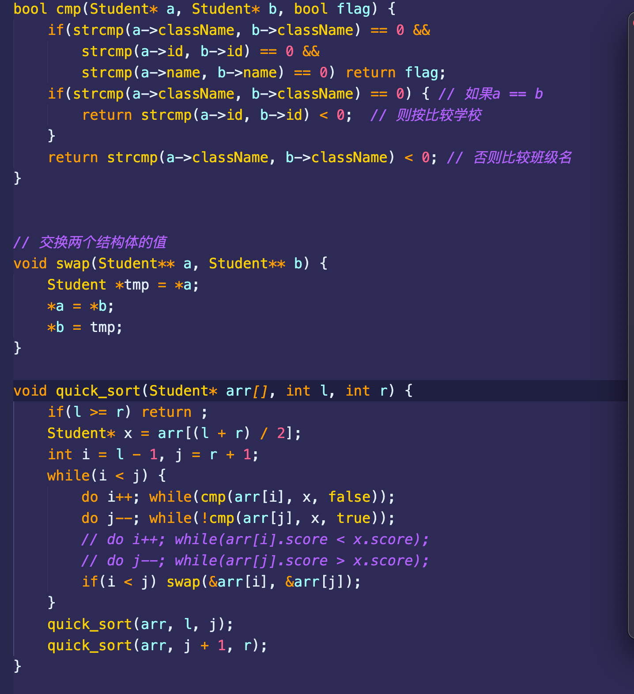

# 目录

## 高精度算法

### 高精度除法（单）

```cpp
#include <iostream>
#include <vector>
#include <algorithm>

using namespace std;

//C = A div b, r = A mod b, A > 0, b > 0
vector<int> div(vector<int> &A, int b, int &r)
{
    vector<int> C;
    r = 0;
    for (int i = A.size() - 1; i >= 0; i -- )
    {
        r = r * 10 + A[i];
        C.push_back(r / b);
        r %= b;
    }

    reverse(C.begin(), C.end());
    while (C.size() > 1 && C.back() == 0) C.pop_back();

    return C;
}

int main()
{
    string a;
    int b;

    cin >> a >> b;

    vector<int> A;
    for (int i = a.size() - 1; i >= 0; i -- ) A.push_back(a[i] - '0');

    int r;
    auto C = div(A, b, r);

    for (int i = C.size() - 1; i >= 0; i -- ) printf("%d", C[i]);
    cout << endl << r << endl;
    return 0;
}
```


### 高精度除法（双）

```cpp
#include<iostream>
#include<cstring>

using namespace std;

int a[100] ,b[100] ,c[100];

int compare(int a[],int b[])
{
    if(a[0] > b[0]) return 1;
    if(a[0] < b[0]) return -1;
    for (int i = a[0]; i > 0; i -- )
    {
        if(a[i] > b[i]) return 1;
        if(a[i] < b[i]) return -1;
    }
    
    return 0;
}

void subduction(int a[],int b[])
{
    int flag = compare(a,b);
    if (flag == 0)
    {
        a[0] = 0;
        return;
    }
    if (flag)
    {
        for (int i = 1; i <= a[0]; i ++ )
        {
            if (a[i] < b[i])
            {
                a[i + 1] --;
                a[i] += 10;
            }
            a[i] -= b[i];
        }
        while(a[0] > 0 && a[a[0]] == 0) a[0] --;
    }
}

int main()
{
    char str1[100], str2[100];
    int temp[100];
    
    memset(a, 0, sizeof(a));
    memset(b, 0, sizeof(b));
    memset(c, 0, sizeof(c));
    memset(temp,0,sizeof(temp));
    
	cin >> str1 >> str2;
	
    a[0] = strlen(str1);
    b[0] = strlen(str2);
    c[0] = a[0] - b[0] + 1;
    
    for (int i = 1; i <= a[0]; i ++ ) a[i] = str1[a[0] - i] - '0';
    for (int i = 1; i <= b[0]; i ++ ) b[i] = str2[b[0] - i] - '0';
    
    for (int i = c[0]; i > 0; i -- )
    {
        for (int j = 1; j <= b[0]; j ++ ) temp[j + i - 1] = b[j];
        temp[0] = b[0] + i - 1;
        while(compare(a, temp) >= 0)
        {
            c[i] ++;
            subduction(a, temp);
        }
    }

    while(c[0] > 0 && c[c[0]] == 0) c[0] --;
    cout << "商为：";
    if(!c[0]) cout << 0 << endl;
    else
    {
        for (int i = c[0]; i > 0; i -- ) cout << c[i];
        cout << endl;
    }

    cout << "余数为：";
    if(!a[0]) cout << 0 << endl;
    else
    {
        for (int i = a[0]; i > 0; i -- ) cout << a[i];
    }

    return 0;
}
```


### 高精度乘法（单）

```cpp
#include <iostream>
#include <algorithm>
#include <vector>

using namespace std;

//c = A * b, A > 0, b > 0
vector<int> mul(vector<int> &A, int b)
{
	vector<int> C;
	
	for (size_t i = 0, t = 0; i < A.size() || t; i ++ )
	{
		if (i < A.size()) t += A[i] * b;
		C.push_back(t % 10);
		t /= 10;
	}
	
	return C;
}

int main()
{
	string a;
	int b;
	
	cin >> a >> b;
	
	vector<int> A;
	for (int i = a.size() - 1; i >= 0; i -- ) A.push_back(a[i] - '0');
	
	auto C = mul(A, b);
	
	for (int i = C.size() - 1; i >= 0; i -- ) printf("%d", C[i]);
	
	return 0;
}
```


### 高精度乘法（双）

```cpp
#include <cstdio>
#include <cstring>
#include <iostream>

using namespace std;

const int N = 1e6 + 10;

char a1[N], b1[N];
int a[N] = {0}, b[N] = {0}, c[N] = {0}; 

int main()
{
    cin >> a1 >> b1;
    int lena = strlen(a1), lenb = strlen(b1);
    for (int i = 0; i < lena; i ++ ) a[lena - i] = a1[i] - '0';
    for (int i = 0; i < lenb; i ++ ) b[lenb - i] = b1[i] - '0';

    for (int i = 1; i <= lena; i ++ )
    {
        int x = 0;
        for (int j = 1; j <= lenb; j ++ )
        {
            c[i + j - 1] = a[i] * b[j] + c[i + j - 1] + x;
            x = c[i + j - 1] / 10;
            c[i + j - 1] %= 10;
        }
        c[i + lenb] = x;
    }

    int len = lena + lenb;
    while (!c[len] && len > 1) len--;
    for (int i = len; i > 0; i -- ) cout << c[i];

    return 0;
}
```


### 高精度加法

```cpp
#include <iostream>
#include <vector>

using namespace std;

const int N = 1e6 + 10;

//C = A + B, A >= 0, B >= 0
vector<int> add(vector<int> &A, vector<int> &B)
{
	vector<int> C;
	
	int t = 0;
	for (size_t i = 0; i < A.size() || i < B.size(); i ++ )
	{
		if (i < A.size()) t += A[i];
		if (i < B.size()) t += B[i];
		C.push_back(t % 10);
		t /= 10;
	}
	
	if (t) C.push_back(t);
	return C;
}

int main()
{
	string a, b;
	vector<int> A, B;
	
	cin >> a >> b;
	for (int i = a.size() - 1; i >= 0; i--) A.push_back(a[i] - '0');
	for (int i = b.size() - 1; i >= 0; i--) B.push_back(b[i] - '0');
	
	auto C = add(A, B);
	
	for (int i = C.size() - 1; i >= 0; i--) printf("%d", C[i]);
	
	return 0;
}

```


### 高精度减法

```cpp
#include <iostream>
#include <vector>
#include <algorithm>

using namespace std;

bool cmp(vector<int> &A, vector<int> &B)
{
	if (A.size() != B.size()) return A.size() > B.size();
	for (size_t i = A.size() - 1; i >= 0; i -- )
		if (A[i] != B[i])
			return A[i] > B[i];
	return true;
}

// C = A - B, A > 0, B > 0
vector<int> sub(vector<int> &A, vector<int> &B)
{
	vector<int> C;
	for (size_t i = 0, t = 0; i < A.size(); i ++ )
	{
		t = A[i] - t;
		if (i < B.size()) t	-= B[i];
		C.push_back((t + 10) % 10);
		if (t < 0) t = 1;
		else t = 0;
	}
	
	while (C.size() > 1 && C.back() == 0) C.pop_back();
	
	return C;
}

int main()
{
	string a, b;
	vector<int> A, B;
	
	cin >> a >> b;
	for (int i = a.size() - 1; i >= 0; i -- ) A.push_back(a[i] - '0');
	for (int i = b.size() - 1; i >= 0; i -- ) B.push_back(b[i] - '0');
	
	if (cmp(A, B))
	{
		auto C = sub(A, B);
		
		for (int i = C.size() - 1; i >= 0; i -- ) printf("%d", C[i]);
	}
	else
	{
		auto C = sub(B, A);
		
		printf("-");
		for (int i = C.size() - 1; i >= 0; i -- ) printf("%d", C[i]);
	}
	
	return 0; 
}

```


## 素数筛

### 埃氏筛

```cpp
#include <stdio.h>
#include <math.h>
#include <string.h>

int main()
{
	int n;
	bool f[1000000];
	memset(f, true, 1000000);
	scanf("%d", &n);
	
	for (int i = 2; i <= sqrt(n); i ++ )
	{
		if (f[i])
			for (int j = 2; i * j <= n; j ++ ) 
				f[i * j] = false;
	}
	
	for (int i = 2; i <= n; i ++ )
		if (f[i]) 
			printf("%d ", i);

	return 0;
} 
```


### 线性筛

```cpp
#include <stdio.h>
#include <string.h>

int main()
{
	int n, total = 0;
	int a[100000];
	bool f[100000];
	scanf("%d", &n);
	memset(f, true, sizeof(f));
	
	for (int i = 2; i <= n; i ++ )
	{
		if (f[i] == true) a[total ++ ] = i;
		for (int j = 0; j < total && i * a[j] <= n; j ++ )
		{
			f[i * a[j]] = false;
			if (i % a[j] == 0) break;
		}
	}
	
	for (int i = 0; i < total; i ++ ) printf("%d ", a[i]);

	return 0;
} 
```


## dijkstra算法

又叫做spf算法


## 字符串匹配算法

### BF

```cpp
#include <iostream>
#include <string.h>

using namespace std;

const int N = 1e4 + 10, M = 1e5 + 10;

int n, m;
char p[N], s[M]; //s是源字符串，p是模式字符串

int bf(char *p, int p1, char *s, int s1)
{
    int i = 0, j = 0;
    while (i < p1 && j < s1)
    {
        if (p[i] == s[j])
        {
            ++i;
            ++j;
        }
        else
        {
            ++j;
            i = 0;
        }
    }
    if (i >= p1)
        return j - p1;
    else
        return -1;
}

int main()
{
    cin >> p >> s;

    cout << bf(p, strlen(p), s, strlen(s)) << endl;

    return 0;
}
```


### BM

```cpp
#include <cstdio>
#include <string.h>

#define MAX(x, y) x > y ? x : y

const int SIZE = 256;
const int MAX_CHAR = 256;

void PreBmBc(char *pattern, int m, int *bmBc)
{
    memset(bmBc, m, sizeof(bmBc));

    for (int i = 0; i < m - 1; i++)
    {
        bmBc[pattern[i]] = m - 1 - i;
    }
}

void suffix_old(char *pattern, int m, int suff[])
{
    suff[m - 1] = m;

    for (int i = m - 2; i >= 0; i--)
    {
        int j = i;
        while (j >= 0 && pattern[j] == pattern[m - 1 - i + j])
            j--;

        suff[i] = i - j;
    }
}

void suffix(char *pattern, int m, int suff[])
{
    int f;

    suff[m - 1] = m;
    int g = m - 1;
    for (int i = m - 2; i >= 0; --i)
    {
        if (i > g && suff[i + m - 1 - f] < i - g)
            suff[i] = suff[i + m - 1 - f];
        else
        {
            if (i < g)
                g = i;
            f = i;
            while (g >= 0 && pattern[g] == pattern[g + m - 1 - f])
                --g;
            suff[i] = f - g;
        }
    }
}

void PreBmGs(char *pattern, int m, int *bmGs)
{
    int suff[SIZE];

    // 计算后缀数组
    suffix(pattern, m, suff);

    // 先全部赋值为m，包含Case3
    memset(bmGs, m, sizeof(bmGs));

    // Case2
    for (int i = m - 1, j = 0; i >= 0; i--)
    {
        if (suff[i] == i + 1)
        {
            for (; j < m - 1 - i; j++)
            {
                if (bmGs[j] == m)
                    bmGs[j] = m - 1 - i;
            }
        }
    }

    // Case1
    for (int i = 0; i < m - 1; i++)
    {
        bmGs[m - 1 - suff[i]] = m - 1 - i;
    }
}

void BoyerMoore(char *pattern, int m, char *text, int n)
{
    int i, j = 0, bmBc[MAX_CHAR], bmGs[SIZE];

    // Preprocessing
    PreBmBc(pattern, m, bmBc);
    PreBmGs(pattern, m, bmGs);

    // Searching
    while (j <= n - m)
    {
        for (i = m - 1; i >= 0 && pattern[i] == text[i + j]; i--)
            ;
        if (i < 0)
        {
            printf("Find it, the position is %d\n", j);
            j += bmGs[0];
            return;
        }
        else
        {
            j += MAX(bmBc[text[i + j]] - m + 1 + i, bmGs[i]);
        }
    }
}

int main()
{
    char text[256], pattern[256];

    scanf("%s%s", text, pattern);
    BoyerMoore(pattern, strlen(pattern), text, strlen(text));

    return 0;
}
```


### KMP

```cpp
#include <iostream>

using namespace std;

const int N = 1e4 + 10, M = 1e5 + 10;

int n, m;
char p[N], s[M]; //s是源字符串，p是模式字符串，这里的数组都是从1开始的
int ne[N];       //next数组

int main()
{
    cin >> n >> (p + 1) >> m >> (s + 1); //加一是后面有/0

    //求解next数组过程
    //next数组的意义：在以当前的点为结尾的字符串子串当中，使得子串的前缀与后缀相等的字符串的最大长度
    //ne[1] = 0;
    for (int i = 2, j = 0; i <= n; i++)
    {
        //i表示当前要计算的结点的坐标
        //j表示的是以 前一个点 作为结尾的子串的前缀等于后缀的字符串的最大长度
        while (j && p[i] != p[j + 1])
        {
            //对于一个新的next[i]，要想快速得到它的值最好的办法就是先看它next[i - 1]的值，即j值

            //如果j = 0就会有两种情况：

            //要么是ne[1]，那么就没必要找前缀等于后缀了（因为本身就是第一个，前缀就等于后缀）

            //要么就是前一个数也找不到前缀等于后缀的情况，那就直接看当前的值是否和第一个值相同（此时j + 1就表示第一个值）
            //这里会有一个疑问，就是当前面的一个数找不到前缀等于后缀的情况，为什么后面一个数就只能找第一个匹配呢？
            //可以这样思考：把当前一个数比作是尾巴，以前一个数为结尾的子串中能和头部匹配的部分是头部
            //匹配是讲究头尾都要配对的
            //如果当前是0的话，就表示连头部都没有了，那尾巴即使能匹配又能怎样呢？

            //而如果j > 0，说明前面是有“头部”和“头部”互相匹配的

            //那么此时再看p[i] 和 p[j + 1]的比较，一个是当前需要匹配的值，另一个是“头部”之后的一个值
            //如果二者相同，那么就是说即存在“头部”和“尾部”都匹配的情况

            //如果不相同，那就说明需要找新的“头部”去匹配
            //如何找新的头部呢，如果是正常的思路，那就是一个一个去往前面遍历匹配，但效率低下
            //先看一下已知的条件：有两个“头部”是相等的，但是加上了一个新的值（尾部）又不相等了
            //那既然要和最前面的数据相匹配，最好的办法就是找到此时“头部”的“头部”，挖坑.....
            j = ne[j];
        }
        if (p[i] == p[j + 1])
        {
            //如果当前的p[1,j + 1] = p[i - j + 1, i]，即前缀等于后缀且长度是最大的
            //那么j = j + 1，表示当前的前缀（或后缀）字符串的最大长度
            //接下来就赋值给ne[i]
            //否则不相等的话，就证明无法找到前缀等于后缀的情况，那ne[i]就等于0
            j++;
        }
        ne[i] = j;
    }

    //kmp匹配过程
    for (int i = 1, j = 0; i <= m; i++)
    {
        //j表示当前对模式字符串中的已经匹配成功的字符的数量
        //i表示当前对源字符串中的第几个字符进行匹配
        while (j && s[i] != p[j + 1])
        {
            //对于s[i] 和 p[j + 1]的比较，如果相同，就把j的数值加一
            //表示的是当前能够匹配到第j + 1项
            //如果不相同，那就把当前匹配的部分往后倒退ne[j]，因为ne[j]表示的就是后缀与前缀相等的部分
            //即使倒退了，也能继续匹配得上
            j = ne[j]; //结束条件，j已经退无可退，s[i] == p[j + 1]
        }
        if (s[i] == p[j + 1])
        {
            j++; //如果当前的数值相等，就j = j + 1;
        }
        if (j == n) //说明此时s字符串的第i位与p字符串的最后一位相同，即已经找到了模式字符串在源字符串的其中一个位置了
        {
            printf("%d ", i - n); //输出是从哪里开始匹配上的
            j = ne[j];            //然后再往后回退，重新再匹配
        }
    }

    return 0;
}
```


## gcd

- ```cpp
  int gcd(int a, int b) {
      return b ? gcd(b, a % b) : a;
  }
  ```

- 辗转相除法，计算两个整数的最大公约数


## 洗牌算法

384、打乱数组

**问题：**

要求生成1-100的随机数，并符合以下要求

- 给定一个rand，需要设计的函数中每次只能调用一次rand()（给定的rand可以认为是均匀分布在int上的）
- 要求每个数被选取的概率都是均匀的
- 如果一次性调用了100次，那么这100次中，要不重复的出现1-100中所有的数字

<br/>

**思路：**

在函数中设定一个static数组arr，大小为100，数组中每个下标都放入数字i + 1（第0个位置放置1）

最开始有int count = 100, number = rand() % count；

因此将首先将arr[number]返回给用户，然后将arr[number]和arr[count - 1]的数字进行交换，然后将count -- 

这样就能够符合上述条件

而如果说count == 0，那么就需要重置一遍数组和count


## 质数

- 求解一个数的所有质数因子（1不是质数..）

- ```cpp
  std::vector<int> solve(int n) {
      int i = 2;
      vector<int> res;
      while (i * i <= n && n >= i) {
          while (n % i == 0) {
              n /= i;
              res.push_back(i);
          }
          ++ i;
      }
      if (n - 1 != 0) {
          res.push_back(n);
      }
      return res;
  }
  ```


- 求解一个范围内的质数

- ```cpp
  vector<int> solve(int n) {
      vector<int> res;
      for (int i = 2; i <= n; ++ i) {
          int count{1};
          for (int j = 2; j * j <= n; ++ j) {
              if (i % j == 0) {
                  ++ c
                  break;
              }
          }
          if (count == 1) res.push_back(i);
      }
      return res;
  }
  
  //	筛选法，空间换时间
  vector<int> solve(int n) {
      int j;
      vector<bool> all(n, true);
      vector<int> res;
      for (j = 2; j <= sqrt(n); ++ j) {
          if (all[j] == false) continue;
          for(int i = 2; i * j <= n; ++ i) {
              all[i * j] = false;
          }
      }
      for (int i = 2; i <= n; ++ i) {
          if(all[i] == true) {
              res.push_back(i);
          }
      }
      return res;
  }
  ```

- 


## tire树（字典树）

- 建立结点tirenode，包含一个指向该结点的数组和一个bool值，布尔值是用来判断是否存在以该节点为末的单词
- 然后依次实现插入，查询单词，查询前缀的操作
- 这道题没啥好说的，注意细节就行了
- 上次didi就考了.....，我直接失忆...


## 前缀和

- 二维前缀和
  - 304.二维区域和检索 - 矩阵不可变
  - 剑指offer II 013.二维子矩阵的和


## 快速幂

- 剑指offer 14- II.剪绳子 II
- 剑指offer 16 数字的整数次方

```cpp
int fastindex(int base, int index) {
    int result = 1;
    while (index > 1) {
        if (index % 2 == 0) {
            index /= 2;
            base *= base;
        } else {
            index -- ;
            index /= 2;
            base *= base;
            result *= base;
        }
    }

    return result;
}
```


## 拓扑排序

- 例题：课程表，课程表II
- 这类题其实有点像模板题，乍一看有点不明来路，但是经过可以训练后是可以达到效果的
- 思路如下：用一个一维数组记录该点的先修课（入度），再用一个二维数组，对于每节课，学了这节课，可以学哪些课
- 然后再把入度为0的课程放入一个队列中（入度为0，表示这节课可以直接上，不需要先修课）
- 然后遍历队列，遍历到的课就是上过了的，然后对那些先修课又这节课的课程，减一他们的入度
- 接着判断入度是否为0，如果是，就代表可以学习了，就把他放入队列中
- 直到队列中没有元素，最后判断


## 差分数组

- 背景：
  - 如果给你一个包含5000万个元素的数组，然后会有频繁区间修改操作，那什么是频繁的区间修改操作呢？比如让第1个数到第1000万个数每个数都加上1，而且这种操作时频繁的
  - 此时你应该怎么做？很容易想到的是，从第1个数开始遍历，一直遍历到第1000万个数，然后每个数都加上1，如果这种操作很频繁的话，那这种暴力的方法在一些实时的系统中可能就拉跨了
- 使用差分数组，数组的每一项记录的是当前的数与前一项的差值
- 如果想要将指定范围内的数字全部加3，比如下标2-4之间的数字全部加上3，那就在差分数组的1位置加上3，5位置减去3；然后如果想要获取数组的值，就一次遍历一遍差分数组，去更新原数组
- 例题：
  - 1094、拼车
  - 1109、航班预定统计
- 个人觉得比较麻烦的其实是数组边界的调整...（参考1109）


## 辗转相除法


## LRU/LFU

- 460.lfu缓存

- lru

- ```cpp
  struct DLinkedNode {
      int key, value;
      DLinkedNode* prev;
      DLinkedNode* next;
      DLinkedNode(): key(0), value(0), prev(nullptr), next(nullptr) {}
      DLinkedNode(int _key, int _value): key(_key), value(_value), prev(nullptr), next(nullptr) {}
  };
  
  class LRUCache {
  private:
      unordered_map<int, DLinkedNode*> cache;
      DLinkedNode* head;
      DLinkedNode* tail;
      int size;
      int capacity;
  
  public:
      /*init*/
      LRUCache(int _capacity): capacity(_capacity), size(0) {
          /*
              使用伪头部和伪尾部节点，方便后续结点的添加和删除
              因为还没有结点，所以先两个结点相连
          */
          head = new DLinkedNode();
          tail = new DLinkedNode();
          head -> next = tail;
          tail -> prev = head;
      }
  
      /*获取key*/
      int get(int key) {
          /*如果key不存在，就返回-1*/
          if (!cache.count(key)) {
              return -1;
          }
  
          /*如果key存在，先通过哈希表定位，然后把结点移到头部*/
          DLinkedNode* node = cache[key];
          moveToHead(node);
  
          return node -> value;
      }
      
      /*插入结点key和value*/
      void put(int key, int value) {
          if (!cache.count(key)) {
              /*如果 key 不存在，创建一个新的节点*/
              DLinkedNode* node = new DLinkedNode(key, value);
              /*结点添加进哈希表*/
              cache[key] = node;
              /*结点添加至双向链表的头部*/
              addToHead(node);
              /*链表长度增加*/
              size ++ ;
              /*如果超出容量，删除双向链表的尾部节点，删除hash中对应的项*/
              if (size > capacity) {
                  DLinkedNode* removed = removeTail();
                  cache.erase(removed -> key);
                  /*防止内存泄漏*/
                  delete removed;
                  size -- ;
              }
          } else {
              /*如果key存在，先通过哈希表定位，然后更新value的值，接着把结点移到头部*/
              DLinkedNode* node = cache[key];
              node -> value = value;
              moveToHead(node);
          }
      }
  
      /*添加结点到头结点的位置*/
      void addToHead(DLinkedNode* node) {
          node -> prev = head;
          node -> next = head -> next;
          head -> next -> prev = node;
          head -> next = node;
      }
      
      /*删除结点*/
      void removeNode(DLinkedNode* node) {
          node -> prev -> next = node -> next;
          node -> next -> prev = node -> prev;
      }
  
      /*将该结点放置头结点的位置*/
      void moveToHead(DLinkedNode* node) {
          removeNode(node);
          addToHead(node);
      }
  
      /*删除最后一个结点*/
      DLinkedNode* removeTail() {
          DLinkedNode* node = tail -> prev;
          removeNode(node);
          return node;
      }
  };
  ```


## 蓄水池抽样法

- 挖坑（https://blog.csdn.net/weixin_41481113/article/details/83449009）


## 鸡蛋楼梯问题

- 高楼扔鸡蛋

- 挖坑（非常经典的google面试题）


## 实现优先队列

- 挖坑


## 下一个排列

- 31，非常的经典，可以好好看看！！


## 部分排序

- 也是非常巧妙的从两边遍历得到结果


## 其他

- 在脉脉上看到的字节面试题

  - 题干：给定一个整型数组，在数组中找出由三个数组成的最大乘积
  - 题解：找min1,min2,max1,max2,max3，最大数要么就是max1 * max2 * max3，要么就是max3 * min1 * min2
  
- hys面试遇到的字节面试题
  - 题干：把数字转换为中文：100001，转换为十万零一
  
- 在脉脉上看到的算法题目
  - 将无限循环小数0.157157157转换为分数
  - 解答：x=0157.....，1000x=157+x，x=157/999
  - lc上有相关的题目，总结就是几位循环就除以几个9（比如0.151515，就是15/99），如果前面有0但不是循环位的话，就在原有的基础上再除以10的n次方
  
- 在nowcoder上看到的
  - 第一题是实现一个线程池类，然后用这个实现多线程矩阵旋转。 本人go语言的。对线程池不熟，沟通无果，硬着头皮敲。线程池基本实现，多线程矩阵旋转写成了单线程了。我写了半小时(包括想了六七分钟)，他问了我代码细节十五分钟吧，然后直接让我反问。 然后没了
  
- 实现自定义排序

  - ```cpp
    struct AdItem {
    std::string ad_id;
    int priority;
    int score;
    };
    ```

  - 实现一个函数，按照如下规则排序

    - 按照priority升序排列
    - 如果priority一样大，则按照score降序排列
    - 如果priority一样，则随机排序

  - 本质上就是快排，不过是重写一遍cmp函数

  - 这里考察的是排序的 strick weaken order

  - 
